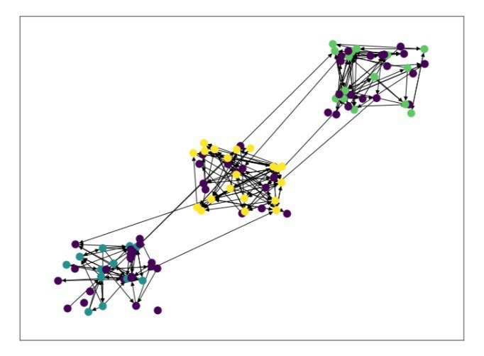

# Finding connected components

In this project we have worked with different approaches to finding and analysing connections between different data types using Tarjan’s SCC algorithm and DBSCAN algorithm.  Strongly connected components, found by the first algorithm,can give us useful information about graph connectivity. The DBSCAN algorithm allows to successfully determine partitions of points, thus it is a reliable solution for clustering. The both algorithms were tested on random datasets, synthetic and real-life datasets and on the same dataset in order to better understand their differences and common points.

## DBSCAN algorithm
The DBSCAN (Density-Based Spatial Clustering of Applications with Noise) algorithm is used to cluster the data points in some geometrical space with defined non-Boolean distances. One of the most important benefits of this algorithm is that it is able to discover arbitrary shaped clusters and to eliminate statistical outliners(noise).

   Results of clustering using DBSCAN algorithm
## Tarjan’s SCC algorithm
This algorithm allows to find strongly connected components in directed graphs. For more information see [here](https://en.wikipedia.org/wiki/Tarjan%27s_strongly_connected_components_algorithm). 

The image below provides a visual representation of the results of applying DBSCAN algorithm and  Tarjan’s SCC algorithm.

   Strongly connected components found by Tarjan’s SCC algorithm (black arrows) and clustering using DBSCAN algorithm (colored points).
